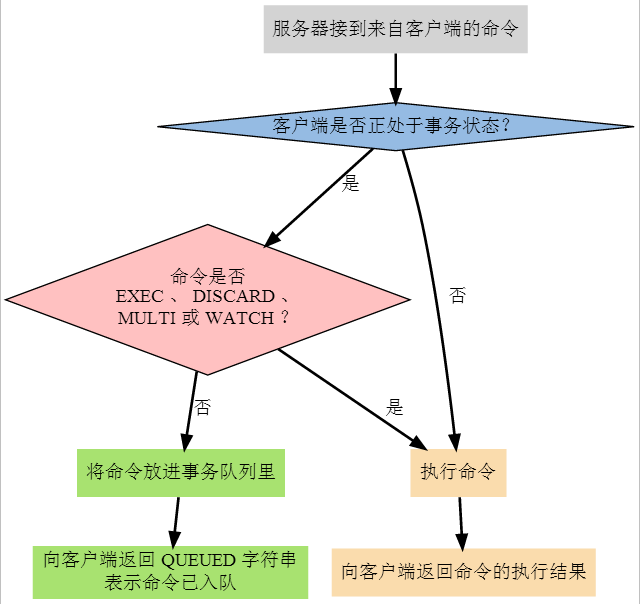

`Redis`通过`MULTI`、`DISCARD`、`EXEC`和`WATCH`四个命令来实现事务功能。Redis事务提供了一种“将多个命令打包， 然后一次性、按顺序地执行”的机制，并且事务在执行的期间不会主动中断（服务器在执行完事务中的所有命令之后， 才会继续处理其他客户端的其他命令）。

`Redis`先以`MULTI`开始一个事务，然后将多个命令入队到事务中，最后由`EXEC`命令触发事务，一并执行事务中的所有命令。
```
127.0.0.1:6379> MULTI
OK
127.0.0.1:6379> HSET article:1 title "Redis事务机制"
QUEUED
127.0.0.1:6379> SADD article:1:tags redis transaction
QUEUED
127.0.0.1:6379> SMEMBERS article:1:tags
QUEUED
127.0.0.1:6379> EXEC
1) (integer) 1
2) (integer) 2
3) 1) "redis"
   2) "transaction"
```

一个事务从开始到执行会经历以下三个阶段：  
1. 开始事务
2. 命令入队
3. 执行事务

事务命令与普通命令执行上区别在于，普通命令执行后立即返回结果，事务命令执行先入队，`EXEC`后一次执行，并返回执行结果。

`DISCARD`命令用于取消一个事务，它清空客户端的整个事务队列，然后将客户端从事务状态调整回非事务状态， 最后返回字符串OK给客户端，说明事务已被取消。
```
127.0.0.1:6379> MULTI
OK
127.0.0.1:6379> HSET article:1 title "Redis事务机制"
QUEUED
127.0.0.1:6379> SADD article:1:tags redis transaction
QUEUED
127.0.0.1:6379> SMEMBERS article:1:tags
QUEUED
127.0.0.1:6379> DISCARD
OK
```

`Redis`的事务是不可嵌套的，当客户端已经处于事务状态，而客户端又再向服务器发送`MULTI`时， 服务器只是简单地向客户端发送一个错误， 然后继续等待其他命令的入队。`MULTI`命令的发送不会造成整个事务失败， 也不会修改事务队列中已有的数据。


`WATCH`命令用于在事务开始之前监视任意数量的键：当调用`EXEC`命令执行事务时， 如果任意一个被监视的键已经被其他客户端修改了， 那么整个事务不再执行，直接返回失败。  

在时间T4，客户端B修改了name键的值，当客户端A在T5执行`EXEC`时，`Redis`会发现name这个被监视的键已经被修改，因此客户端A的事务不会被执行，而是直接返回失败。

`Redis`事务保证了其中的`一致性（C）`和`隔离性（I）`，但并不保证`原子性（A）`和`持久性（D）`。

#### 原子性(Atomicity)  
因为`Redis`并没有回滚机制，所以也就无从保证事务的`原子性`。
#### 一致性(Consistency)  
`Redis`的一致性问题可以分为三部分来讨论：入队错误、执行错误、`Redis`进程被终结。
* 在命令入队的过程中，如果客户端向服务器发送了错误的命令，比如命令的参数数量不对，等等，那么服务器将向客户端返回一个出错信息，并且将客户端的事务状态设为`REDIS_DIRTY_EXEC`。当客户端执行`EXEC`命令时，`Redis`会拒绝执行状态为`REDIS_DIRTY_EXEC`的事务， 并返回失败信息。

```
127.0.0.1:6379> MULTI
OK
127.0.0.1:6379> SET key
(error) ERR wrong number of arguments for 'set' command
127.0.0.1:6379> EXISTS key
QUEUED
127.0.0.1:6379> EXEC
(error) EXECABORT Transaction discarded because of previous errors.
```

* 如果命令在事务执行的过程中发生错误，那么`Redis`只会将错误包含在事务的结果中，这不会引起事务中断或整个失败，不会影响已执行事务命令的结果，也不会影响后面要执行的事务命令， 所以它对事务的一致性也没有影响。
```
127.0.0.1:6379> MULTI
OK
127.0.0.1:6379> SET name zlikun
QUEUED
127.0.0.1:6379> INCR name
QUEUED
127.0.0.1:6379> GET name
QUEUED
127.0.0.1:6379> EXEC
1) OK
2) (error) ERR value is not an integer or out of range
3) "zlikun"
```

* `Redis`进程被终结，如果 Redis 服务器进程在执行事务的过程中被其他进程终结，或者被管理员强制杀死，那么根据`Redis` 所使用的持久化模式，可能有以下情况出现：
  * 内存模式：如果`Redis`没有采取任何持久化机制，那么重启之后的数据库总是空白的，所以数据总是一致的。
  * RDB模式：在执行事务时`Redis`不会中断事务去执行保存`RDB`的工作，只有在事务执行之后，保存`RDB`的工作才有可能开始。所以当`RDB`模式下的`Redis`服务器进程在事务中途被杀死时，事务内执行的命令，不管成功了多少，都不会被保存到`RDB`文件里。恢复数据库需要使用现有的`RDB`文件，而这个`RDB`文件的数据保存的是最近一次的数据库快照（snapshot），所以它的数据可能不是最新的，但只要`RDB`文件本身没有因为其他问题而出错，那么还原后的数据库就是一致的。
  * AOF模式：因为保存`AOF`文件的工作在后台线程进行，所以即使是在事务执行的中途，保存`AOF`文件的工作也可以继续进行，因此，根据事务语句是否被写入并保存到`AOF`文件，有以下两种情况发生：
    1. 如果事务语句未写入到`AOF`文件，或`AOF`未被`SYNC`调用保存到磁盘，那么当进程被杀死之后，`Redis`可以根据最近一次成功保存到磁盘的`AOF`文件来还原数据库，只要`AOF`文件本身没有因为其他问题而出错，那么还原后的数据库总是一致的，但其中的数据不一定是最新的。
    2. 如果事务的部分语句被写入到`AOF`文件，并且`AOF`文件被成功保存，那么不完整的事务执行信息就会遗留在`AOF`文件里，当重启`Redis`时，程序会检测到`AOF`文件并不完整，`Redis`会退出，并报告错误。需要使用 `redis-check-aof`工具将部分成功的事务命令移除之后，才能再次启动服务器。还原之后的数据总是一致的，而且数据也是最新的（直到事务执行之前为止）。

#### 隔离性(Isolation)  
`Redis`是单进程程序，并且它保证在执行事务时，不会对事务进行中断，事务可以运行直到执行完所有事务队列中的命令为止。因此，`Redis`的事务是总是带有隔离性的。

#### 持久性(Durability)  
因为事务不过是用队列包裹起了一组 Redis 命令，并没有提供任何额外的持久性功能，所以事务的持久性由 Redis 所使用的持久化模式决定：
  * 在单纯的内存模式下，事务肯定是不持久的。
  * 在`RDB`模式下，服务器可能在事务执行之后`RDB`文件更新之前的这段时间失败，所以`RDB`模式下的`Redis`事务也是不持久的。
  * 在`AOF`的“总是`SYNC`”模式下，事务的每条命令在执行成功之后，都会立即调用`fsync`或`fdatasync`将事务数据写入到`AOF`文件。但是，这种保存是由后台线程进行的，主线程不会阻塞直到保存成功，所以从命令执行成功到数据保存到硬盘之间，还是有一段非常小的间隔，所以这种模式下的事务也是不持久的。其他`AOF`模式也和“总是`SYNC`”模式类似，所以它们都是不持久的。

本文整理自：<http://origin.redisbook.com/feature/transaction.html>
